# FeedbackFlow Security Audit Research

## TL;DR

**VERDICT:** Multiple critical security vulnerabilities identified including authentication bypass via mock tokens, hardcoded JWT secrets, SQL injection risks, and sensitive data exposure in localStorage. Immediate remediation required before production deployment.

---

## Visual Flow: Authentication & Authorization Architecture

```mermaid
flowchart TD
    subgraph Client["Frontend (React)"]
        A[User Login] --> B{Auth Method}
        B -->|Mock| C[POST /auth/login/mock]
        B -->|Google| D[POST /auth/login/google]
        C --> E[Token Stored in localStorage]
        D --> E
        E --> F[Token Sent via Cookie + Header]
    end
    
    subgraph Server["Backend (Express)"]
        F --> G{auth.middleware.ts}
        G -->|mock-jwt-token-*| H[⚠️ BYPASS: No Verification]
        G -->|Real JWT| I[jwt.verify with SECRET]
        I -->|Invalid| J[401 Unauthorized]
        H --> K[Extract email from token string]
        I --> L[Decode payload]
        K --> M[Fetch user from DB]
        L --> M
        M --> N[Set req.user]
        N --> O{RBAC Middleware}
        O -->|Pass| P[Controller]
        O -->|Fail| Q[403 Forbidden]
    end
    
    subgraph Database["PostgreSQL"]
        M --> R[(users table)]
        M --> S[(user_roles table)]
    end
    
    style H fill:#ff6b6b,stroke:#c92a2a,color:#fff
    style E fill:#ffd43b,stroke:#fab005
```



---

## The Case

### 🔴 CRITICAL Vulnerabilities

#### 1. Mock Token Authentication Bypass

**Facts:**
- File: `backend/src/shared/middleware/auth.middleware.ts:66-100`
- Any token starting with `mock-jwt-token-` bypasses JWT verification
- Attacker can forge tokens: `mock-jwt-token-victim@company.com-12345`

**Evidence:**

```typescript
// auth.middleware.ts:66-70
if (token.startsWith('mock-jwt-token-')) {
  const parts = token.split('-');
  if (parts.length >= 4) {
    const email = parts.slice(3, -1).join('-');
    // NO VERIFICATION - proceeds to grant access
```

**Impact:** Complete authentication bypass. Attacker can impersonate any user.

---

#### 2. Hardcoded JWT Secret Fallback

**Facts:**
- File: `backend/src/shared/middleware/auth.middleware.ts:5`
- File: `backend/src/app.ts:96`
- File: `backend/src/mock-database-server.ts:9`
- Default secrets: `'changeme'`, `'dev-secret-key-change-in-production'`

**Evidence:**

```typescript
// auth.middleware.ts:5
const jwtService = new JwtService(process.env.JWT_SECRET || 'changeme');

// mock-database-server.ts:9
const JWT_SECRET = process.env.JWT_SECRET || 'dev-secret-key-change-in-production';
```

**Impact:** If `JWT_SECRET` env var is not set, tokens can be forged with known secret.

---

#### 3. Token Stored in localStorage (XSS Vulnerable)

**Facts:**
- File: `frontend/src/stores/authStore.ts:180-183`
- File: `frontend/src/lib/api.ts:31`
- Token persisted via Zustand's `persist` middleware to `auth-storage`

**Evidence:**

```typescript
// authStore.ts:180-183
{
  name: 'auth-storage',
  partialize: (state) => ({ token: state.token, user: state.user }),
}

// api.ts:31
const storedAuth = localStorage.getItem('auth-storage')
```

**Impact:** XSS attack can steal authentication token. Contradicts claimed httpOnly cookie approach.

---

### 🟠 HIGH Vulnerabilities

#### 4. SQL Injection Risk in BaseModel

**Facts:**
- File: `backend/src/models/BaseModel.ts:66,72,120`
- `tableName` and `sortBy` interpolated directly into SQL strings
- `sortBy` comes from user-provided `options.sortBy`

**Evidence:**

```typescript
// BaseModel.ts:66
const countResult = await query(`SELECT COUNT(*) FROM ${this.tableName}`);

// BaseModel.ts:72
`SELECT * FROM ${this.tableName} 
 ORDER BY ${sortBy} ${sortOrder.toUpperCase()}`
```

**Impact:** If `sortBy` is user-controlled without whitelist validation, SQL injection is possible.

---

#### 5. Unprotected Routes in real-database-server.ts

**Facts:**
- File: `backend/src/real-database-server.ts`
- Many routes defined directly on `app` without `authenticateToken` middleware
- Lines: 92 (health), 3195 (settings/reset), 3342-4221 (hierarchy endpoints)

**Evidence:**

```typescript
// Multiple unprotected routes:
app.get('/api/v1/health', (req, res) => { ... });
app.post('/api/v1/settings/reset', async (req, res) => { ... });
app.delete('/api/v1/hierarchy/clear/:organizationId', async (req, res) => { ... });
app.post('/api/v1/hierarchy', async (req, res) => { ... });
```

**Impact:** Unauthenticated users may access or modify sensitive data.

---

#### 6. Sensitive Data Logged

**Facts:**
- File: `backend/src/shared/middleware/auth.middleware.ts:52-54`
- Token fragments (first 50 chars) logged with emoji prefix

**Evidence:**

```typescript
// auth.middleware.ts:52-54
console.log('🔍 Auth middleware - received token:', token?.substring(0, 50) + '...',
            'from:', authHeader ? 'header' : 'cookie',
            'hostname:', req.hostname);
```

**Impact:** Tokens may leak to logs, log aggregation systems, or monitoring tools.

---

### 🟡 MEDIUM Vulnerabilities

#### 7. Verbose Error Messages Expose Internal Details

**Facts:**
- File: `backend/src/real-database-server.ts` (multiple locations)
- Error messages include `error.message` directly in responses
- Stack traces exposed in development mode

**Evidence:**

```typescript
// real-database-server.ts:438
details: error instanceof Error ? error.message : 'Unknown error'

// real-database-server.ts:7451
...(process.env.NODE_ENV === 'development' && { stack: error.stack })
```

**Impact:** Internal system details may help attackers identify vulnerabilities.

---

#### 8. CORS Allows Multiple Localhost Origins

**Facts:**
- File: `backend/src/app.ts:53-66`
- File: `backend/src/real-database-server.ts:57-68`
- Allows localhost ports 3003, 3006, 5173, 5174 + undefined origin

**Evidence:**

```typescript
// real-database-server.ts:57-68
const allowedOrigins = [
  'http://localhost:3006',
  'http://localhost:3003',
  'http://localhost:5173',
  'http://localhost:5174',
  undefined,  // Allow requests with no origin (e.g., mobile apps, curl)
```

**Impact:** Overly permissive in development; `undefined` origin acceptance weakens CORS.

---

#### 9. Mock Virus Scanning Service

**Facts:**
- File: `backend/src/services/VirusScanService.ts:24-56`
- Uses `Math.random()` to simulate scan results
- Returns 99% clean, 1% infected randomly

**Evidence:**

```typescript
// VirusScanService.ts:38-39
const isInfected = Math.random() < 0.01;
```

**Impact:** No actual malware protection; malicious files could be uploaded.

---

### 🟢 LOW Vulnerabilities

#### 10. No CSRF Protection Visible

**Facts:**
- No `csrf` or `csurf` middleware found in grep search
- Cookie-based auth without CSRF tokens

**Impact:** Potential for CSRF attacks if `sameSite` cookies aren't properly enforced.

---

#### 11. Console Logging in Production Code

**Facts:**
- 71+ `console.log/error/warn` calls found in backend
- Includes sensitive operation logging (auth, passwords, tokens)

**Impact:** Performance impact; potential information disclosure via logs.

---

#### 12. Missing Input Validation on Some Routes

**Facts:**
- File: `backend/src/modules/auth/routes/settings.routes.ts`
- Routes like `/password`, `/delete-account` lack validation middleware

**Evidence:**

```typescript
// settings.routes.ts:77
router.post('/password', async (req: Request, res: Response, next: NextFunction) => {
  // No validationMiddleware applied before handler
```

**Impact:** Invalid or malicious input may reach business logic.

---

## Summary Table

| # | Severity | Vulnerability | Location | Recommendation |
|---|----------|---------------|----------|----------------|
| 1 | 🔴 Critical | Mock Token Bypass | auth.middleware.ts:66 | Remove mock token support or gate behind `NODE_ENV` |
| 2 | 🔴 Critical | Hardcoded JWT Secret | Multiple files | Fail startup if `JWT_SECRET` not set |
| 3 | 🔴 Critical | Token in localStorage | authStore.ts:180 | Use httpOnly cookies exclusively |
| 4 | 🟠 High | SQL Injection Risk | BaseModel.ts:72 | Whitelist allowed `sortBy` values |
| 5 | 🟠 High | Unprotected Routes | real-database-server.ts | Apply `authenticateToken` to all `/api/v1/*` routes |
| 6 | 🟠 High | Token Logging | auth.middleware.ts:52 | Remove token logging or mask entirely |
| 7 | 🟡 Medium | Verbose Errors | real-database-server.ts | Return generic errors to clients |
| 8 | 🟡 Medium | Permissive CORS | app.ts:53 | Restrict to production domains only |
| 9 | 🟡 Medium | Mock Virus Scanner | VirusScanService.ts | Integrate real AV (ClamAV/AWS) |
| 10 | 🟢 Low | No CSRF Protection | N/A | Add `csurf` middleware |
| 11 | 🟢 Low | Console Logging | Multiple | Use proper logger with levels |
| 12 | 🟢 Low | Missing Validation | settings.routes.ts | Add `validationMiddleware` |

---

## Confidence Level

**HIGH** - Findings based on direct code inspection with file/line references.

---

## Recommended Remediation Priority

1. **Immediate (Day 1):**
   - Remove mock token authentication bypass
   - Ensure `JWT_SECRET` is required, not optional
   - Move token from localStorage to httpOnly cookies only

2. **Short-term (Week 1):**
   - Add authentication middleware to all routes
   - Whitelist `sortBy` parameter values
   - Remove sensitive data from logs

3. **Medium-term (Month 1):**
   - Implement real virus scanning
   - Add CSRF protection
   - Implement proper logging framework
   - Add input validation to all routes

---

Created by Octocode MCP https://octocode.ai 🔍🐙

