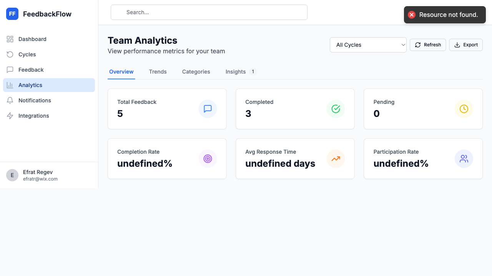

# FeedbackFlow Visual Presentation
## Example Slides with Screenshots

*This is a preview showing what the presentation looks like with actual screenshots*

---

## Slide 1: Title

# FeedbackFlow
## Transform Your Performance Management

**Tagline:** From spreadsheet chaos to automated excellence


---

## Slide 4: Dashboard Overview

## Your Command Center

**Everything at a glance**


**Key Features Visible:**
- ✅ Pending feedback count
- ✅ Completion metrics  
- ✅ Recent feedback list
- ✅ Quick actions
- ✅ Navigation sidebar

---

## Slide 12: Team Analytics

## Powerful Insights for Managers

**Data-driven team development**



**Key Metrics:**
- 📊 Team completion rate
- ⭐ Average performance ratings
- ⏱️ Response time trends
- 📈 Quarter-over-quarter comparisons

---

## What This Shows You

### ✅ The Good News

You already have some screenshots! The ones above are from your `frontend/` directory:
- `simple-dashboard.png` - Shows the dashboard layout
- `simple-feedback.png` - Shows the feedback/login interface  
- `debug-analytics-page.png` - Shows the analytics page

### 📸 What You Still Need

Following the `Screenshot-Capture-Guide.md`, you'll need to capture:

**High Priority (for core demo):**
1. ✅ Login page (you have this)
2. ✅ Dashboard (you have this)  
3. ⚠️ Cycles list page
4. ⚠️ Create cycle form
5. ⚠️ Feedback form (give feedback)
6. ⚠️ Feedback list (received feedback)
7. ✅ Analytics page (you have this)

**Medium Priority (for complete presentation):**
8. ⚠️ Feedback detail view
9. ⚠️ Notifications center
10. ⚠️ User management (admin)

**Lower Priority (nice to have):**
11. ⚠️ Org hierarchy
12. ⚠️ Settings page

---

## Quick Win Strategy

### Option 1: Use Existing Screenshots (5 minutes)

You can create a **minimal presentation NOW** using screenshots you already have:

1. Copy existing screenshots to the screenshots folder:
```bash
cd /Users/itays/dev/feedbackflow-app
cp frontend/simple-feedback.png docs/screenshots/01-title-landing.png
cp frontend/simple-dashboard.png docs/screenshots/04-dashboard-overview.png
cp frontend/debug-analytics-page.png docs/screenshots/12-team-analytics.png
```

2. Create a short 10-slide deck with just these features:
   - Login
   - Dashboard
   - Analytics
   - Text descriptions for other features

3. Present with live demo for missing features

### Option 2: Capture Priority Screenshots (20 minutes)

Focus on the **7 high-priority screenshots**:

1. Start the app: `cd backend && npm run dev` + `cd frontend && npm run dev`
2. Login as manager@example.com
3. Capture these pages:
   - Cycles page (5 min)
   - Create cycle form (2 min)
   - Give feedback form (5 min)
   - Feedback list page (3 min)
   - Feedback detail (3 min)
   - Notifications (2 min)

4. You'll have 80% of the presentation ready

### Option 3: Complete All Screenshots (45 minutes)

Follow the full `Screenshot-Capture-Guide.md` for a comprehensive presentation

---

## Converting to Google Slides

### Step 1: Open Google Slides
- Go to slides.google.com
- Click "Blank" or choose "Simple Light" template

### Step 2: Create Slides

For each section in `FeedbackFlow-Visual-Presentation.md`:

1. **Title slide:**
   - Large text: "FeedbackFlow"
   - Subtitle: "Transform Your Performance Management"
   - Insert image: `01-title-landing.png`

2. **Feature slides:**
   - Slide title from the markdown
   - Bullet points from "Key Features" or description
   - Insert corresponding screenshot
   - Position screenshot on right 50% of slide

3. **Analytics slides:**
   - Full-width screenshot
   - Overlay text box with key metrics

### Step 3: Apply Styling

- **Font:** Use consistent font (Roboto, Open Sans, or Inter)
- **Colors:** 
  - Primary: Blue (#3B82F6 - matches FeedbackFlow branding)
  - Accent: Green for success metrics
  - Text: Dark gray (#1F2937)
- **Layout:** 
  - Title on left
  - Screenshot on right
  - Or full-width screenshot with overlays

---

## Presentation Flow Example

### Recommended Slide Order (Minimal - 12 slides)

1. **Title** - Brand introduction
2. **Problem** - Pain points
3. **Solution** - How FeedbackFlow helps
4. **Dashboard** - Overview of system
5. **Cycles** - Create review cycles  
6. **Feedback** - Give & receive feedback
7. **Analytics** - Team insights
8. **Notifications** - Automated reminders
9. **Admin** - User management
10. **Results** - Success metrics
11. **Pricing** - Plans and pricing
12. **CTA** - Call to action

### For Technical Demo (Add these)

13. **Architecture** - System design (if needed)
14. **Integrations** - Slack, webhooks
15. **Security** - Authentication & data protection

---

## Sample Slide Layouts

### Layout 1: Title + Screenshot (Most Common)

```
┌─────────────────────────────────────────────────────┐
│ Feature Name                                        │
├──────────────────────┬──────────────────────────────┤
│ • Bullet point 1     │                              │
│ • Bullet point 2     │                              │
│ • Bullet point 3     │     [SCREENSHOT]             │
│                      │                              │
│ Benefits:            │                              │
│ ✅ Save time         │                              │
│ ✅ Increase quality  │                              │
└──────────────────────┴──────────────────────────────┘
```

### Layout 2: Full-Width Screenshot

```
┌─────────────────────────────────────────────────────┐
│ Feature Name                                        │
├─────────────────────────────────────────────────────┤
│                                                     │
│                  [FULL SCREENSHOT]                  │
│                                                     │
├─────────────────────────────────────────────────────┤
│ Key takeaway text or stats                         │
└─────────────────────────────────────────────────────┘
```

### Layout 3: Before/After Comparison

```
┌─────────────────────────────────────────────────────┐
│ Problem → Solution                                  │
├──────────────────────┬──────────────────────────────┤
│ ❌ Before            │ ✅ After                     │
├──────────────────────┼──────────────────────────────┤
│ • Manual tracking    │ • Automated tracking         │
│ • 68% completion     │ • 95% completion             │
│ • 40 hours           │ • 8 hours                    │
│                      │                              │
│ [Old way screenshot] │ [New way screenshot]         │
└──────────────────────┴──────────────────────────────┘
```

---

## 🎯 Your Next Steps

### Right Now (Choose One):

**Quick Option (5 min):**
```bash
# Copy existing screenshots
cd /Users/itays/dev/feedbackflow-app
cp frontend/simple-feedback.png docs/screenshots/01-title-landing.png
cp frontend/simple-dashboard.png docs/screenshots/04-dashboard-overview.png  
cp frontend/debug-analytics-page.png docs/screenshots/12-team-analytics.png

# Start with 3-screenshot presentation
```

**Better Option (30 min):**
```bash
# Follow the guide to capture priority screenshots
open docs/Screenshot-Capture-Guide.md

# Or: code docs/Screenshot-Capture-Guide.md
```

**Complete Option (60 min):**
```bash
# Capture all 17 screenshots following the guide
# Then convert to Google Slides with complete visual flow
```

---

## 💡 Pro Tips

### For Live Presentations

1. **Start app before presenting** - Have it running for live demo
2. **Use dual monitors** - Slides on one, live demo on other
3. **Prepare talking points** - 2-3 key points per slide
4. **Time yourself** - Practice to stay within 15-20 min

### For Async Sharing

1. **Add speaker notes** - In Google Slides "Notes" section
2. **Record voiceover** - Use Loom or Google Slides recording
3. **Export to PDF** - For email distribution
4. **Create video** - Screen record walking through slides

### For Different Audiences

**For Executives (10 min):**
- Slides: 1-4, 10, 18-20 (Problem, Solution, Results, CTA)
- Focus on ROI and business impact

**For HR Teams (20 min):**
- All slides with emphasis on features (5-17)
- Focus on workflow and daily use

**For Technical Teams (30 min):**
- Add architecture and integration slides
- Show API documentation
- Discuss security and scalability

---

## ✅ You're All Set!

You now have:
- ✅ Complete presentation structure
- ✅ Screenshot capture guide
- ✅ Example slides with your existing screenshots
- ✅ Conversion instructions for Google Slides
- ✅ This example showing what it looks like

**Next action:** Decide which option above to proceed with (Quick, Better, or Complete)

Good luck with your presentation! 🚀

