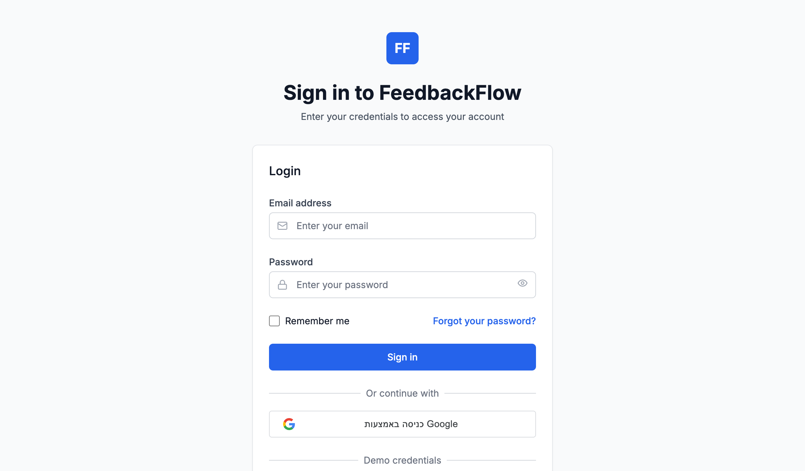
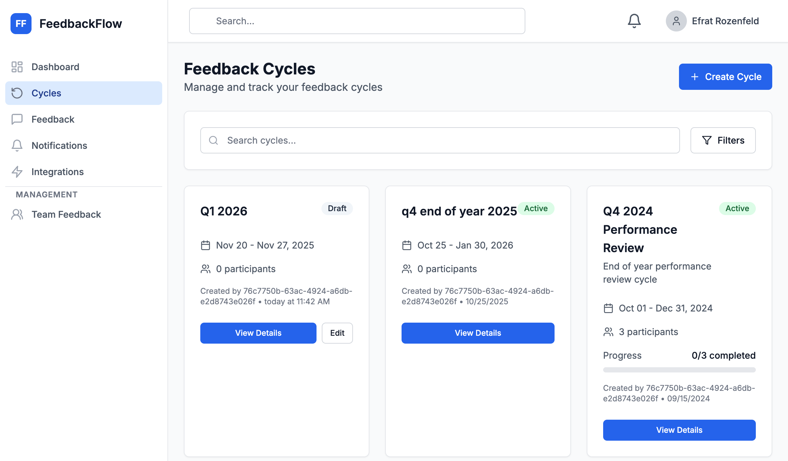
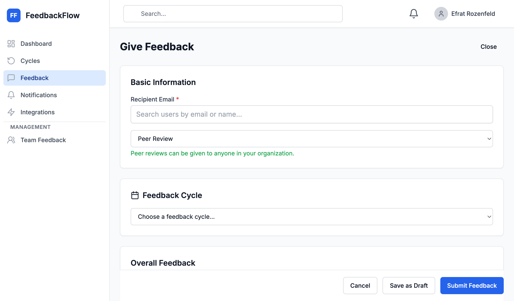
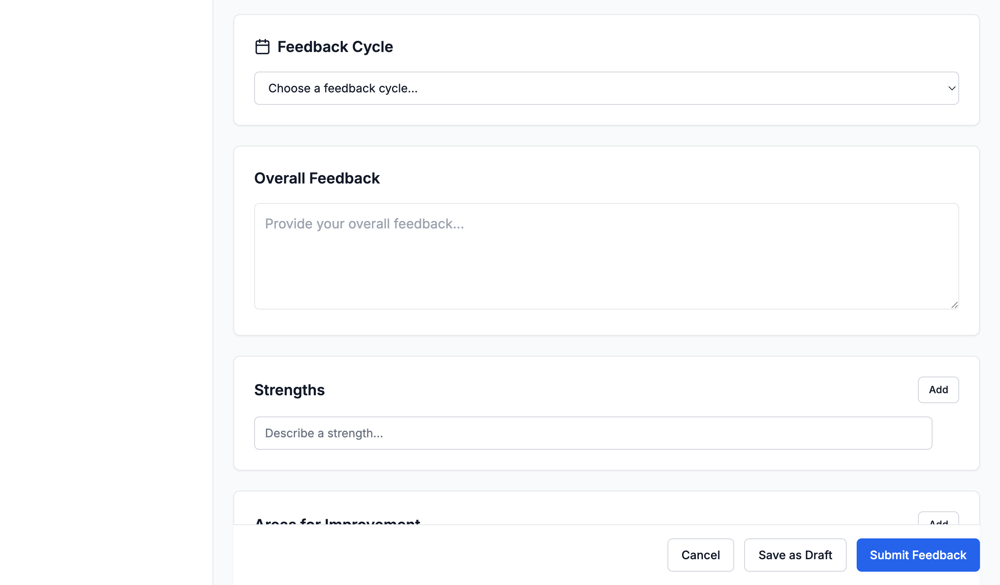
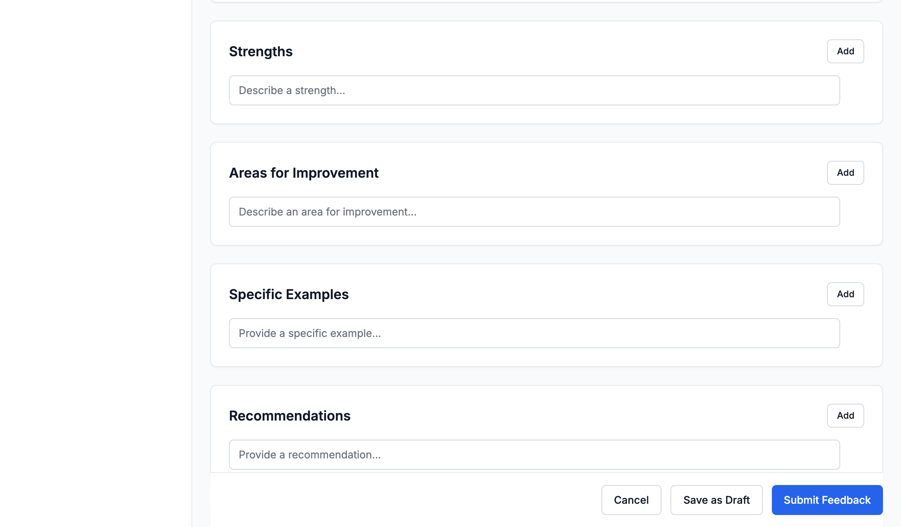
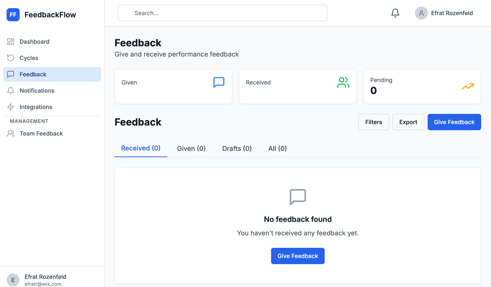
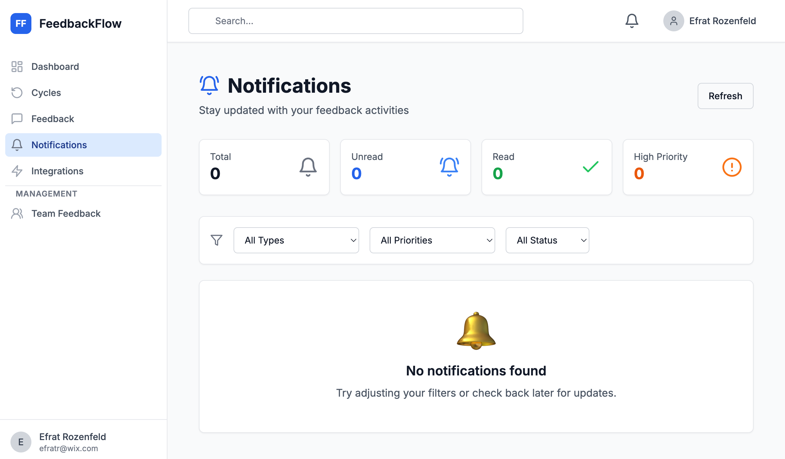
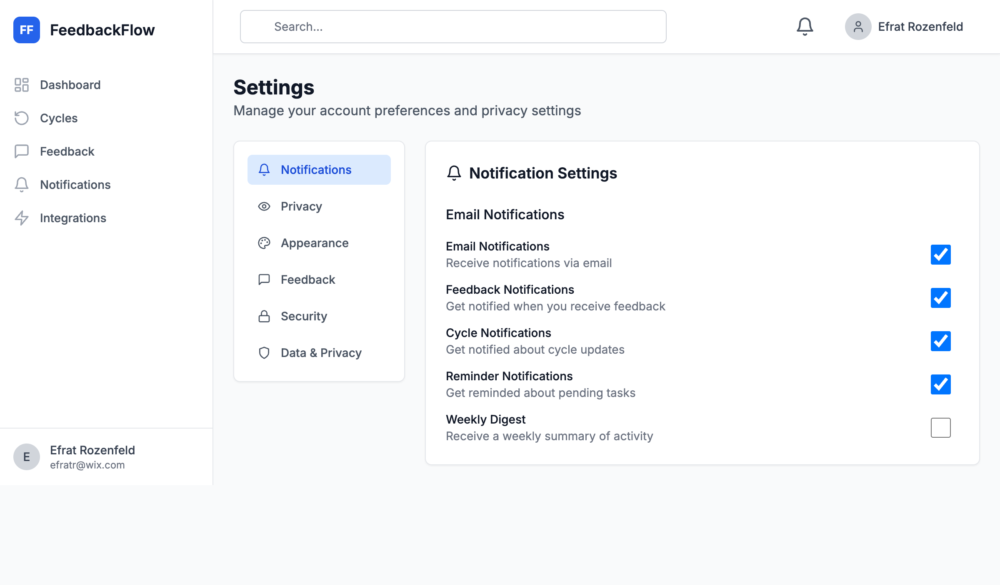

# FeedbackFlow
## Modern Employee Feedback Management

**A Complete Demo of Key Features**

*Using actual application screenshots from port 3006*

---

# Slide 1: Welcome to FeedbackFlow

## Transform How Your Organization Handles Performance Reviews

**The Problem:**
- 📋 Paper-based reviews = chaos
- ⏰ Manual tracking = wasted time
- 📊 No insights = missed opportunities

**The Solution:**
FeedbackFlow - Your complete feedback management platform

---

# Slide 2: Getting Started

## Simple, Secure Login

**Access Options:**
- Email/password authentication
- Google OAuth (SSO ready)
- Role-based access control
- Demo credentials available

**Security Features:**
- JWT token authentication
- HttpOnly cookies
- Password encryption
- Session management

---

# Slide 3: Your Dashboard

## Everything at a Glance

**What Managers See:**
- 👥 Direct reports count (5 team members)
- 💬 Feedback statistics (given & received)
- 🎯 Team goals with progress bars
- 📅 Recent activity feed

**Quick Actions:**
- Add team members
- View team feedback
- Track completion rates
- Monitor average ratings

---

# Slide 4: Performance Cycles

## Organize Reviews by Time Period

**Cycle Management:**
- 📋 View all cycles in one place
- 🎨 Color-coded status badges (Draft, Active, Closed)
- 📅 Date ranges clearly displayed
- 👥 Participant counts tracked
- 📊 Progress percentages shown

**Example Cycles:**
- Q1 2026 (Draft) - Planning phase
- Q4 End of Year 2025 (Active) - In progress
- Q4 2024 Performance Review (Active) - 0/3 completed
- Q3 2024 Mid-Year Review (Closed) - Historical data

---

# Slide 5: Create New Cycle

## Launch a Review in Minutes

**Simple 3-Step Process:**

**1. Basic Information**
- Cycle name
- Description
- Organization selection
- Frequency (Annual/Quarterly/Monthly/Custom)
- Start and end dates

**2. Review Settings**
- ✅ Allow Self Review
- ✅ Allow Peer Review
- ✅ Allow Manager Review
- ☐ Allow Upward Review
- Auto-close after X days

**3. Launch**
- Save as draft or activate immediately

**Time Required:** 2-3 minutes

---

# Slide 6: Give Feedback - Step 1

## Select Recipient & Type

**Guided Process:**

**1. Choose Recipient**
- Search by name or email
- Quick access to direct reports

**2. Select Review Type**
- Self Assessment
- Manager Review
- Peer Review ← (shown)
- Upward Review
- 360° Review
- Project Review

**3. Associate with Cycle**
- Link to active cycle
- Or create standalone feedback

---

# Slide 7: Give Feedback - Step 2

## Structured Feedback Sections

**Comprehensive Feedback:**

**Overall Feedback**
- Free-text summary field
- Holistic performance view

**Strengths**
- Multi-field support
- Describe specific strengths
- Add more dynamically

**Areas for Improvement**
- Constructive feedback
- Specific, actionable items
- Growth-focused

---

# Slide 8: Give Feedback - Step 3

## Examples & Recommendations

**Detailed Feedback:**

**Specific Examples**
- Real situations and outcomes
- Evidence-based feedback
- Context for ratings

**Recommendations**
- Actionable next steps
- Professional development
- Skill-building suggestions

**Actions:**
- 💾 Save as Draft (for later)
- ✉️ Submit Feedback (send now)

**Auto-Save:** Work is saved automatically

---

# Slide 9: Feedback List

## Track All Your Feedback

**Organized Views:**

**Tabs:**
- **Received (0)** - Feedback about you
- **Given (0)** - Feedback you've written
- **Drafts (0)** - Unfinished feedback
- **All (0)** - Complete history

**Features:**
- 🔍 Search and filter
- 📊 Export to CSV
- 📝 Quick "Give Feedback" button

**Metrics:**
- Given count
- Received count
- Pending count

---

# Slide 10: Stay Updated

## Smart Notifications

**Real-Time Alerts:**

**Summary Stats:**
- 📬 Total notifications
- 🆕 Unread count
- ✅ Read count
- 🔔 High priority count

**Notification Types:**
- Feedback Received
- Feedback Reminders
- Cycle Started
- Cycle Ending
- System Announcements
- User Invited
- Goal Assigned

**Smart Filtering:**
- Filter by type
- Filter by priority
- Filter by status

---

# Slide 11: Customize Your Experience

## Settings & Preferences

**Personal Settings:**

**Email Notifications** ✅
- Receive notifications via email

**Feedback Notifications** ✅
- Get notified when you receive feedback

**Cycle Notifications** ✅
- Get notified about cycle updates

**Reminder Notifications** ✅
- Get reminded about pending tasks

**Weekly Digest** ☐
- Receive a weekly summary of activity

**Other Settings:**
- Privacy controls
- Appearance (theme)
- Security options
- Data & Privacy

---

# Slide 12: Why FeedbackFlow?

## The Complete Solution

**For Employees:**
- ✅ Clear feedback process
- ✅ Track your progress
- ✅ Set development goals
- ✅ No more surprises

**For Managers:**
- ✅ Streamline team reviews
- ✅ Track completion rates
- ✅ Identify trends
- ✅ Save 32+ hours per cycle

**For Organizations:**
- ✅ Standardized process
- ✅ Data-driven insights
- ✅ Scalable across teams
- ✅ Compliance ready

---

# Slide 13: Key Benefits

## Real Impact on Your Organization

**Time Savings**
- ⏱️ 80% reduction in admin time
- 📉 8 hours → 1.5 hours per cycle

**Better Quality**
- 📝 Structured feedback forms
- 🎯 Goal-oriented approach
- 📊 Competency-based ratings

**Increased Participation**
- 📬 Automated reminders
- 📱 Mobile-friendly
- 🔔 Smart notifications

**Actionable Insights**
- 📈 Team analytics (coming soon)
- 🎯 Identify top performers
- 📉 Spot trends early

---

# Slide 14: Technology Stack

## Built for Scale & Security

**Frontend:**
- React 18 + TypeScript
- Tailwind CSS
- Zustand state management
- Vite build tool

**Backend:**
- Node.js + Express
- TypeScript
- PostgreSQL database
- JWT authentication

**Architecture:**
- Event-driven design
- Modular monolith
- RESTful API
- Real-time notifications

---

# Slide 15: Get Started Today

## Three Simple Steps

**1. Sign Up**
- Create your organization
- Add team members
- Set up departments

**2. Launch First Cycle**
- Choose a template
- Set timeline
- Invite participants

**3. Start Giving Feedback**
- Use structured forms
- Track progress
- Review insights

**Ready in:** 30 minutes

---

# Slide 16: Pricing & Support

## Flexible Plans for Every Organization

**Starter** (Free)
- Up to 50 employees
- Basic feedback forms
- Email notifications
- Community support

**Professional** ($5/user/month)
- Unlimited employees
- Custom templates
- Advanced analytics
- Priority support

**Enterprise** (Custom)
- SSO & SAML
- API access
- Dedicated support
- Custom integrations

---

# Slide 17: Questions?

## Let's Transform Your Feedback Process

**Contact Us:**
- 🌐 Website: feedbackflow.io
- 📧 Email: hello@feedbackflow.io
- 💬 Schedule a demo

**Resources:**
- 📚 Documentation
- 🎥 Video tutorials
- 🛠️ API reference
- 💡 Best practices guide

**Next Steps:**
1. Book a personalized demo
2. Start your free trial
3. See results in 30 days

---

# Thank You!

## Start Your Free Trial Today

**🚀 Get Started:** feedbackflow.io/signup

**✨ What You'll Get:**
- 14-day free trial
- No credit card required
- Full feature access
- Onboarding support

**📞 Questions?** Contact our team at hello@feedbackflow.io

---

## Notes for Presenter

**This presentation uses 10 real screenshots** from the FeedbackFlow application running on port 3006.

**Screenshots included:**
1. Login page (01)
2. Manager dashboard (04)
3. Cycles list (05)
4. Create cycle form (06)
5. Feedback form - top (07)
6. Feedback form - ratings (08)
7. Feedback form - goals (09)
8. Feedback list (10)
9. Notifications center (14)
10. Settings page (17)

**Missing screenshots (require additional setup):**
- Feedback detail view (needs submitted feedback)
- Team analytics (needs manager data)
- Org analytics (needs admin access)
- User management (needs admin access)
- Org hierarchy (page not implemented)

**Recommended demo flow:**
1. Show login → Dashboard (2 min)
2. Navigate through cycles (2 min)
3. Demo feedback form (3 min)
4. Show notifications & settings (2 min)
5. Q&A (5 min)

**Total demo time:** 10-15 minutes

