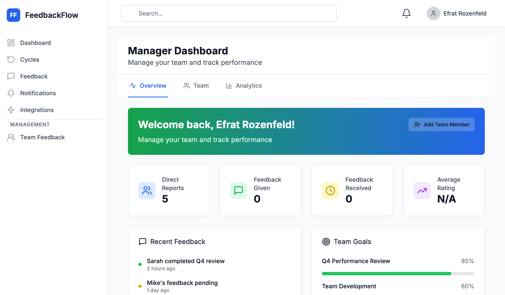

# Screenshot Capture Guide for FeedbackFlow Presentation

## 📸 Overview

This guide provides step-by-step instructions for capturing all screenshots needed for the visual presentation.

**Total Screenshots Needed:** 17  
**Time Required:** 30-45 minutes  
**Tool Recommended:** Built-in screenshot tool or Browser DevTools

---

## 📁 Setup

### 1. Create Screenshot Directory

```bash
cd /Users/itays/dev/feedbackflow-app
mkdir -p docs/screenshots
```

### 2. Start the Application

```bash
# Terminal 1 - Backend
cd backend
npm run dev

# Terminal 2 - Frontend
cd frontend
npm run dev
```

### 3. Browser Setup

- Use **Chrome** or **Firefox** for best results
- Set browser window to **1920x1080** or **1440x900** for consistency
- Disable browser extensions that might interfere
- Use **Incognito/Private mode** for clean screenshots

---

## 📷 Screenshot Checklist

### Slide 1: Title/Landing Page
**File:** `screenshots/01-title-landing.png`

**Steps:**
1. Navigate to: `http://localhost:3003`
2. If logged in, log out first
3. Capture the login page showing:
   - FeedbackFlow logo/branding
   - Clean login form
   - "Demo credentials" section (if visible)

**Tips:**
- Center the form in frame
- Show full page (no scrolling needed)
- Ensure good lighting/contrast

---

### Slide 4: Dashboard Overview
**File:** `screenshots/04-dashboard-overview.png`

**Steps:**
1. **Login as:** Manager (manager@example.com)
2. Navigate to: Dashboard (should be default landing page)
3. Ensure visible:
   - Left sidebar with navigation
   - Quick stats/metrics cards
   - Recent activity or action items
   - User profile in corner

**Tips:**
- Capture full page with sidebar
- Show at least 3-4 stat cards
- Include some sample data

**Alternative:** If manager dashboard is empty, use Admin dashboard:
- Login as: admin@example.com
- Navigate to: Dashboard

---

### Slide 5: Cycles List
**File:** `screenshots/05-cycles-list.png`

**Steps:**
1. **Login as:** Manager or Admin
2. Navigate to: Cycles (click "Cycles" in sidebar)
3. Ensure visible:
   - List of cycles (at least 2-3)
   - Status badges (Active, Closed, Draft)
   - Completion percentages
   - Dates
   - "Create New Cycle" button

**Tips:**
- If no cycles exist, create 1-2 sample cycles first
- Show variety of statuses
- Capture table/list view clearly

---

### Slide 6: Create Cycle Form
**File:** `screenshots/06-create-cycle-form.png`

**Steps:**
1. **From Cycles page**, click "Create New Cycle" or "New Cycle" button
2. Capture the form showing:
   - Cycle name field
   - Start/end date pickers
   - Participant selection (departments, teams, or individuals)
   - Template dropdown
   - Settings/options section

**Tips:**
- Don't fill out the form completely (show empty state)
- Make sure all form sections are visible
- May need to scroll and capture upper portion only

---

### Slide 7: Feedback Form - Top Section
**File:** `screenshots/07-feedback-form-top.png`

**Steps:**
1. **Login as:** Employee or Manager
2. Navigate to: Feedback → "Give Feedback" or click "Give Feedback" button
3. Capture showing:
   - "Select receiver" dropdown (expanded is good)
   - Cycle selection
   - Template name/type
   - First 1-2 competency rating sections
   - Rating scale visible (1-5 stars or numbers)

**Tips:**
- Fill in receiver name so form shows actual content
- Show rating descriptions if visible
- Capture top 40-50% of form

---

### Slide 8: Feedback Form - Ratings Section
**File:** `screenshots/08-feedback-ratings.png`

**Steps:**
1. **Continue in same feedback form**
2. Scroll to middle section
3. Capture showing:
   - 2-3 competency ratings
   - Star ratings or number selections
   - Comment/text boxes
   - Each with some sample input (can be partial)

**Tips:**
- Add sample ratings (3-4 stars) for visual
- Add partial comments to show the feature
- Show variety of competencies (Communication, Teamwork, etc.)

---

### Slide 9: Feedback Form - Goals Section
**File:** `screenshots/09-feedback-goals.png`

**Steps:**
1. **Continue in same feedback form**
2. Scroll to bottom section
3. Capture showing:
   - "Goals" or "Objectives" section
   - Input fields for goals
   - "Add Goal" button
   - "Save as Draft" button
   - "Submit" button

**Tips:**
- Add 1-2 sample goals
- Show the action buttons clearly
- Capture the submit/draft options

---

### Slide 10: Feedback List Page
**File:** `screenshots/10-feedback-list.png`

**Steps:**
1. Navigate to: Feedback (main feedback page)
2. Ensure visible:
   - Tabs at top: "Given", "Received", "Drafts", "Team" (if manager)
   - List of feedback items (at least 3-5)
   - Status badges (Draft, Submitted, Acknowledged, Completed)
   - Dates
   - Giver/Receiver names
   - Filters or search bar

**Tips:**
- Switch to "Received" tab for best view
- Show variety of statuses
- Include dates for context

---

### Slide 11: Feedback Detail Page
**File:** `screenshots/11-feedback-detail.png`

**Steps:**
1. **From Feedback list**, click on any completed feedback item
2. Capture showing:
   - Overall rating or summary at top
   - Individual competency ratings
   - Comments/feedback text
   - Goals section
   - "Acknowledge" button (if not yet acknowledged)
   - Dates and metadata

**Tips:**
- Use a feedback item with actual content
- Show at least 2-3 competency ratings
- Scroll to fit key sections in one screenshot

**Alternative:** If no detailed feedback exists:
- Create sample feedback first
- Or use manager account to view team feedback

---

### Slide 12: Team Analytics
**File:** `screenshots/12-team-analytics.png`

**Steps:**
1. **Login as:** Manager
2. Navigate to: Analytics → "Team Analytics" (or Analytics with team filter)
3. Ensure visible:
   - Metric cards (Completion Rate, Avg Ratings, Response Time)
   - Charts or graphs (bar chart, line chart)
   - Team name or filter
   - Date range selector
   - Export button

**Tips:**
- If data shows "undefined" or "no data", may need to:
  - Create sample feedback first
  - Or capture the UI showing the layout even with placeholder data
- Focus on the dashboard layout

---

### Slide 13: Organization Analytics
**File:** `screenshots/13-org-analytics.png`

**Steps:**
1. **Login as:** Admin
2. Navigate to: Analytics (main analytics page)
3. Ensure visible:
   - Organization-wide metrics
   - Department comparison chart/table
   - Trend graphs over time
   - Filter options (cycle, date range, department)
   - Export buttons (PDF, CSV)

**Tips:**
- Capture overview tab or dashboard view
- Show multiple metric cards
- Include at least one chart/graph

---

### Slide 14: Notifications
**File:** `screenshots/14-notifications.png`

**Steps:**
1. **Login as:** Any user
2. Navigate to: Notifications (click bell icon or "Notifications" in sidebar)
3. Ensure visible:
   - List of notifications (at least 4-5)
   - Unread count badge (if any)
   - Notification types:
     - "Feedback request received"
     - "Deadline reminder"
     - "Feedback submitted"
   - Timestamps
   - Mark as read option
   - Settings or preferences link

**Tips:**
- If no notifications, trigger some by:
  - Creating feedback requests
  - Or use debug tools to generate sample notifications
- Show variety of notification types

---

### Slide 15: User Management (Admin)
**File:** `screenshots/15-user-management.png`

**Steps:**
1. **Login as:** Admin (admin@example.com)
2. Navigate to: Admin → "Users" or "User Management"
3. Ensure visible:
   - User list table with columns:
     - Name
     - Email
     - Role (Admin, Manager, Employee)
     - Department
     - Status (Active, Inactive)
   - "Add User" button
   - "Import CSV" button
   - Edit/Delete actions
   - Search/filter options

**Tips:**
- Show at least 5-8 users
- Include variety of roles
- Highlight the bulk import option

---

### Slide 16: Organizational Hierarchy
**File:** `screenshots/16-org-hierarchy.png`

**Steps:**
1. **Login as:** Admin
2. Navigate to: Admin → "Hierarchy" or "Organization"
3. Capture showing:
   - Organizational chart visualization (if available)
   - OR: Department/team tree structure
   - Manager-employee relationships
   - Department groupings
   - Edit options

**Tips:**
- If visual org chart exists, capture that
- Otherwise, capture the hierarchy management page
- Show at least 2-3 levels of hierarchy

**Note:** Based on the pages I saw, you may have `HierarchyManagement.tsx` - navigate there

---

### Slide 17: Settings/Integrations
**File:** `screenshots/17-settings-integrations.png`

**Steps:**
1. **Login as:** Any user (settings) or Admin (integrations)
2. Navigate to: 
   - **Option A:** Settings (user settings icon or "Settings" in menu)
   - **Option B:** Admin → Integrations

**For User Settings, capture:**
- Profile information
- Notification preferences (email, in-app)
- Language/timezone
- Password change

**For Admin Integrations, capture:**
- Slack integration toggle
- Webhook configuration
- API keys
- Integration status

**Tips:**
- User Settings is easier if Integrations page is not ready
- Focus on notification preferences section

---

### Additional Screenshots (Optional)

If you want to enhance the presentation, capture these:

**Slide 18 Alternative: Template Management**
**File:** `screenshots/18-template-management.png`
- Admin → Templates
- Shows feedback template library

**Mobile View (Bonus)**
**File:** `screenshots/bonus-mobile-view.png`
- Resize browser to mobile width (375x667)
- Capture feedback form on mobile

---

## 📐 Screenshot Best Practices

### Technical Settings

1. **Resolution:**
   - Desktop: 1920x1080 or 1440x900
   - Ensure text is readable when projected

2. **Browser Window:**
   - Full screen or maximized
   - No developer tools visible
   - Hide bookmarks bar

3. **File Format:**
   - PNG (preferred for quality)
   - JPG acceptable (use high quality setting)

### Composition Tips

1. **Framing:**
   - Include sidebar navigation for context
   - Center main content
   - Show header/navigation bar

2. **Content:**
   - Use realistic sample data
   - Avoid Lorem Ipsum or obvious test data
   - Show names like "Sarah Thompson", "Mike Chen" (professional)

3. **Consistency:**
   - Same browser window size for all screenshots
   - Same zoom level (100%)
   - Same logged-in user when possible (for consistency)

### Data Preparation

Before capturing screenshots, prepare sample data:

1. **Create 2-3 sample cycles:**
   - Q1 2025 Performance Review (Active)
   - Q4 2024 Review (Closed)
   - Q2 2025 Planning (Draft)

2. **Create sample feedback:**
   - At least 3-5 feedback items in various states
   - Include drafts, submitted, and acknowledged

3. **Add sample users:**
   - 5-10 users with realistic names
   - Mix of roles (Admin, Manager, Employee)
   - Variety of departments

---

## 🖼️ After Capturing

### 1. Review Checklist

For each screenshot, verify:
- [ ] Correct resolution
- [ ] No personal/sensitive data visible
- [ ] UI is clean (no error messages unless intentional)
- [ ] Text is readable
- [ ] Main feature is clearly visible
- [ ] Named correctly as per guide

### 2. Organize Files

```bash
cd /Users/itays/dev/feedbackflow-app/docs/screenshots

# Verify all files
ls -la

# Expected files:
# 01-title-landing.png
# 04-dashboard-overview.png
# 05-cycles-list.png
# 06-create-cycle-form.png
# 07-feedback-form-top.png
# 08-feedback-ratings.png
# 09-feedback-goals.png
# 10-feedback-list.png
# 11-feedback-detail.png
# 12-team-analytics.png
# 13-org-analytics.png
# 14-notifications.png
# 15-user-management.png
# 16-org-hierarchy.png
# 17-settings-integrations.png
```

### 3. Insert Into Presentation

Update `FeedbackFlow-Visual-Presentation.md`:

Replace:
```markdown
[SCREENSHOT PLACEHOLDER: Dashboard overview]
- File: `screenshots/04-dashboard-overview.png`
```

With:
```markdown

```

Or for Google Slides:
- Insert → Image → Upload from computer
- Select the corresponding screenshot file

---

## 🎯 Quick Capture Script (Optional)

If you want to automate, here's a helper:

```bash
#!/bin/bash
# screenshot-helper.sh

echo "Screenshot Capture Helper"
echo "========================="
echo ""
echo "Current screenshot to capture:"
echo ""
read -p "Enter screenshot number (01, 04, 05, etc.): " NUM
read -p "Enter description: " DESC

echo ""
echo "📸 Ready to capture: $NUM - $DESC"
echo "File will be: screenshots/$(printf "%02d" $NUM)-*.png"
echo ""
echo "Steps:"
echo "1. Arrange browser window"
echo "2. Press Cmd+Shift+4 (Mac) or Print Screen (Windows)"
echo "3. Select area to capture"
echo "4. Save to screenshots/ folder"
echo ""
read -p "Press Enter when done..."
```

---

## 🆘 Troubleshooting

### Issue: No data showing in analytics
**Solution:** Create sample feedback and cycles first

### Issue: Empty feedback list
**Solution:** 
1. Login as manager
2. Create feedback for team members
3. Or use admin account to create sample data

### Issue: Screenshots too large
**Solution:**
- Use PNG compression tool
- Or convert to JPG with 85% quality
- Target size: < 1MB per screenshot

### Issue: UI looks different than described
**Solution:** 
- App is actively developed, UI may have changed
- Capture what exists currently
- Focus on showing the feature functionality

---

## ✅ Final Checklist

Before considering complete:

- [ ] All 17 screenshots captured
- [ ] Files named correctly (01-title-landing.png, etc.)
- [ ] Screenshots show realistic sample data
- [ ] No sensitive/personal information visible
- [ ] All screenshots are clear and readable
- [ ] Files saved in `docs/screenshots/` folder
- [ ] Verified files in presentation markdown

---

**Ready to present!** 🎉

Once all screenshots are captured and inserted, your visual presentation will be complete and ready to convert to Google Slides or PowerPoint.

